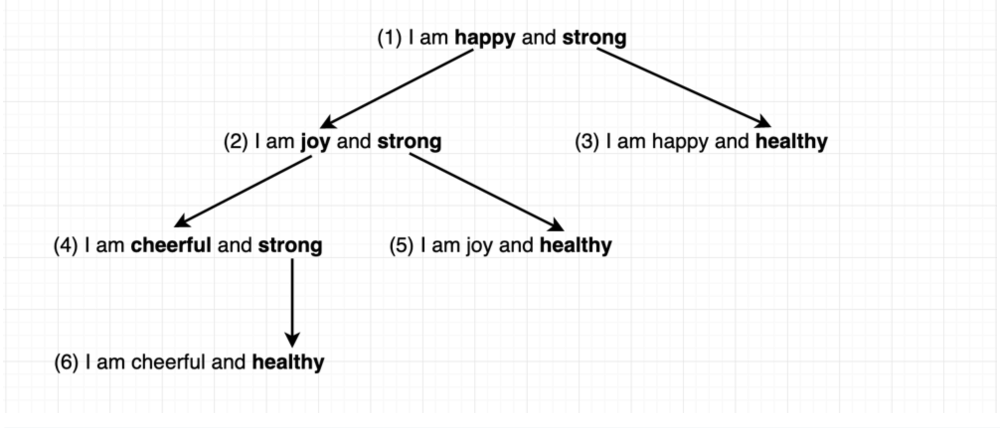

* synonyms = `[["happy","joy"],["strong","healthy"],["joy","cheerful"]]`
* text = "I am happy and strong"

# Solution:


```javascript
/**
 * @param {string[][]} synonyms
 * @param {string} text
 * @return {string[]}
 */
var generateSentences = function(synonyms, text) {
    let adjList = {};
    
    // 1. build graph
    synonyms.forEach(([s1, t1]) => {
        if(!adjList[s1]) {
            adjList[s1] = [];
        }
        
        if(!adjList[t1]) {
            adjList[t1] = [];
        }
        
        adjList[s1].push(t1);
        adjList[t1].push(s1);
    });
    
    let result = []
    let queue = [text];
    let uniqueText = {};
    
    // 2. DFS
    while(queue.length) {
        let node = queue.shift();
        if(!uniqueText[node]){
            uniqueText[node] = 1;
            result.push(node);
        }
        
        let nodeArr = node.split(' ');
        for (let i = 0; i < nodeArr.length; i++){
            if(adjList[nodeArr[i]]) {
                adjList[nodeArr[i]].forEach(synonym => {
                    nodeArr[i] = synonym;
                    let newText = nodeArr.join(' ');
                    if(!uniqueText[newText]) {
                        queue.push(newText);
                        
                        // 3. to make faster
                        uniqueText[newText] = 1;
                        result.push(newText);
                    }
                })
            }
        }
    }
    
    return result.sort();
};
```