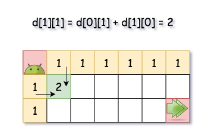
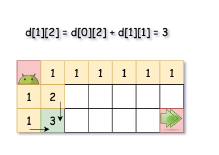
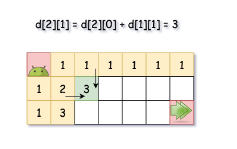
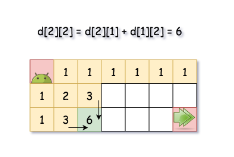
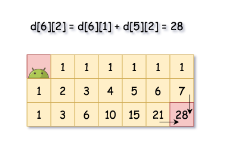

```javascript
/**
 * @param {number} m
 * @param {number} n
 * @return {number}
 */
var uniquePaths = function(m, n) {
// 1) Dynamic programming
// Time O(mn)
// Space O(mn)
    
  let dp = new Array(m).fill([]).map(() => {
    return new Array(n).fill(1);
  });

  for (let i = 1; i < m; i++) {
    for (let j = 1; j < n; j++) {
      dp[i][j] = dp[i - 1][j] + dp[i][j - 1];
    }
  }
  return dp[m - 1][n - 1];
};
```