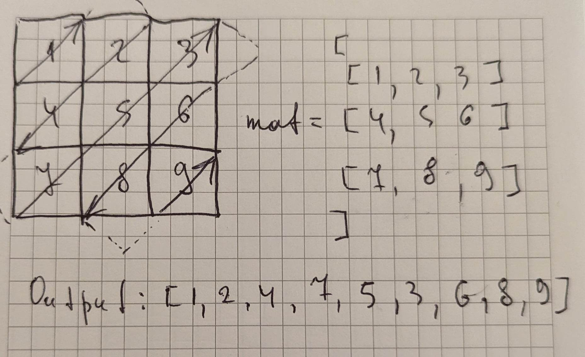

```javascript
/**
 * @param {number[][]} mat
 * @return {number[]}
 */
var findDiagonalOrder = function(mat) {
    if (!mat.length) return mat;
	
	const row = mat.length;
    const col = mat[0].length;
	
    const result = [];
    let r = 0;
    let c = 0;
    let goUp = true; // direction marker
    
    while (result.length < row * col) { // while result is not filled up with (row * col) elements
        result.push(mat[r][c]);
        
        if (goUp) { // if direction is top-right
            if (c === col - 1) { // if last coloumn - move one row down and change direction
                r++;
                goUp = false;
            } else if (r === 0) { // else if first row - move one coloumn right and change direction
                c++;
                goUp = false;
            } else { // else just move diagonally to top-right
                r--;
                c++;
            }
        } else { // if direction is bottom-left
            if (r === row - 1) { // if last row - move right and change direction
                c++;
                goUp = true;
            } else if (c === 0) { // else if first coloumn - move down and change direction
                r++;                   
                goUp = true;
            } else { // else just move diagonally to bottom-left
                r++;
                c--;
            }
        }
    }
    
    return result;
};
```