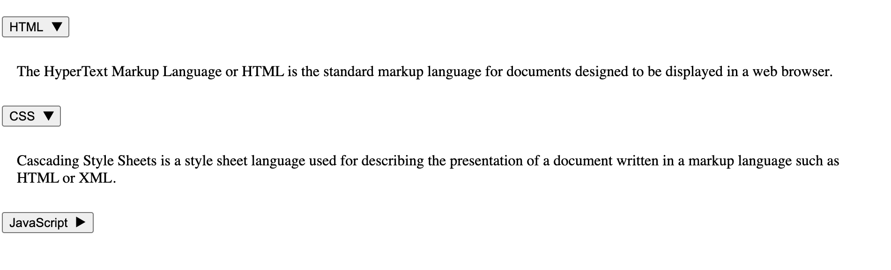

# UI



# Code

```tsx
// App.jsx
import Accordion from './Accordion';

export default function App() {
  return <Accordion />;
}

// Accordion.jsx
import { useState } from 'react';

const accordionData = [
  {
    title: 'HTML',
    content:
      'The HyperText Markup Language or HTML is the standard markup language for documents designed to be displayed in a web browser.',
  },
  {
    title: 'CSS',
    content:
      'Cascading Style Sheets is a style sheet language used for describing the presentation of a document written in a markup language such as HTML or XML.',
  },
  {
    title: 'JavaScript',
    content:
      'JavaScript, often abbreviated as JS, is a programming language that is one of the core technologies of the World Wide Web, alongside HTML and CSS.',
  },
];

export default function Accordion() {
  const [openSections, setOpenSections] = useState({});

  const toggleSection = (index) => {
    setOpenSections((prev) => ({
      ...prev,
      [index]: !prev[index],
    }));
  };

  return (
    <div role="presentation" className="accordion">
      {accordionData.map((item, index) => {
        const isOpen = !!openSections[index];
        const contentId = `accordion-content-${index}`;
        const headerId = `accordion-header-${index}`;

        return (
          <div key={index} className="accordion-item">
            <h3>
              <button
                id={headerId}
                aria-controls={contentId}
                aria-expanded={isOpen}
                onClick={() => toggleSection(index)}
                className="accordion-trigger"
              >
                {item.title}
                <span
                  className="accordion-icon"
                  aria-hidden="true"
                  style={{
                    display: 'inline-block',
                    marginLeft: '0.5rem',
                    transform: isOpen ? 'rotate(90deg)' : 'rotate(0deg)',
                    transition: 'transform 0.2s ease',
                  }}
                >
                  ▶
                </span>
              </button>
            </h3>
            {isOpen && (
              <div
                id={contentId}
                role="region"
                aria-labelledby={headerId}
                className="accordion-panel"
                style={{ padding: '0.5rem 1rem' }}
              >
                {item.content}
              </div>
            )}
          </div>
        );
      })}
    </div>
  );
}

```
