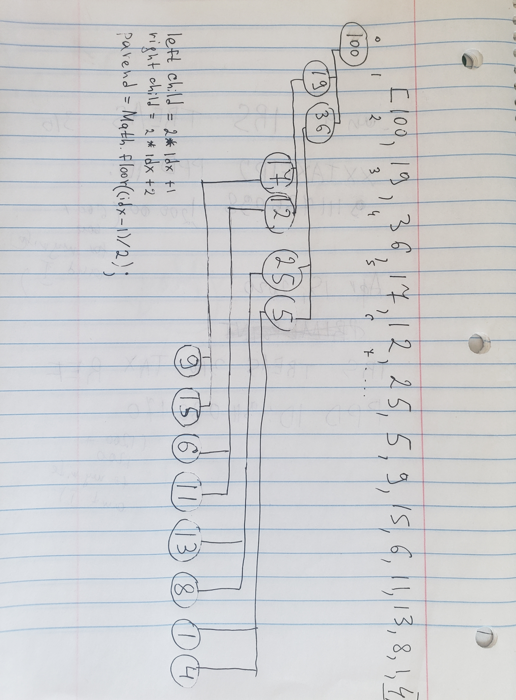

<b>BIG O</b>
```javascript
* insertion - O(log N)
* removal - O(log N)
* search - O(N)
```
<b>Children:</b>
```javascript
For any index of an array n...
let leftChildIdx = 2 * idx + 1;
let rightChildIdx = 2 * idx + 2;
```
<b>Parent:</b>
```javascript
For any child node at index n...
Its parent is at:
let parentIdx = Math.floor((idx - 1)/2);
```

